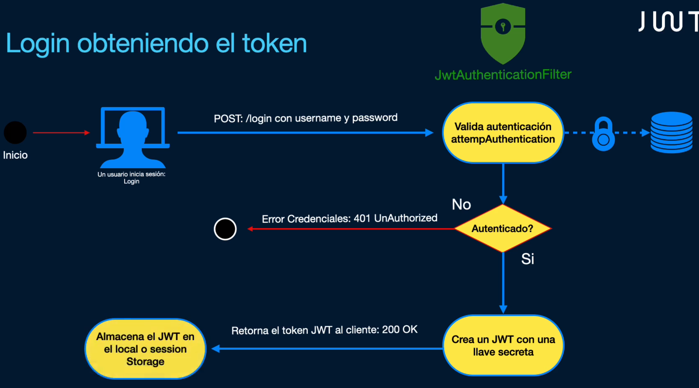
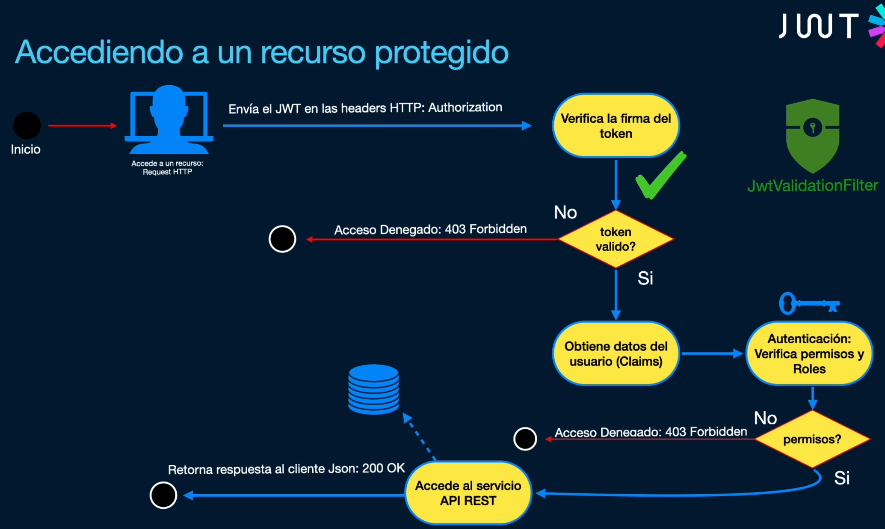

# ¿Qué son los JSON WEB TOKENS?
Es un estándar abierto para implementar seguridad en nuestras aplicaciones API REST
basado en la especificación RFC 7519.
* Escalables
* Codificado y decodificado en Base64
* Contiene reclamaciones o claims
* Firmado mediante una llave secreta
* Compacto
* Autónomo
* Seguridad

# TECNOLOGÍAS
### H2 + MapStruct + ExceptionHandler + JPA + PrePersist + Spring AOP annotation valid
### PasswordEncoder + WebSecurityCustomizer + SecurityFilterChain (permitAll, hasRole, authenticated, ..)
### UserDetailsService + io.jsonwebtoken + AuthenticationConfiguration + UsernamePasswordAuthenticationFilter 
### BasicAuthenticationFilter + EnabledMethodSecurity + @PreAuthorize
### @CrossOrigin + CorsConfigurationSource + FilterRegistrationBean
